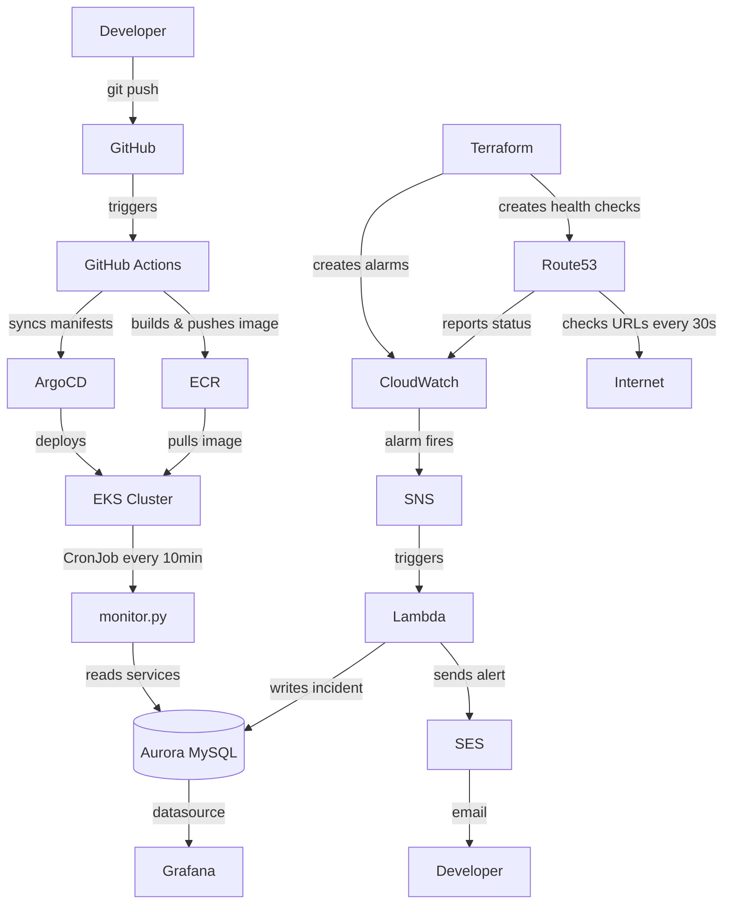

# Service Monitor

I built this because I got tired of finding out a service was down from a customer complaint instead of from my own system.

This is a real-time monitoring platform that watches your URLs, detects failures within 90 seconds, and emails the right developer automatically. No polling dashboards. No manual checks. Just an email when something breaks.

---

## The idea

You add a service to the database — a name, a URL, and the developer's email. That's it. From that point on, AWS Route53 pings that URL every 30 seconds. Three failures in a row and the whole chain fires:

```
Service goes down
      ↓ ~90 seconds later
CloudWatch detects it
      ↓
SNS triggers Lambda
      ↓
Developer gets an email
Incident is saved to the database
Grafana dashboard turns red
```

No one has to notice. The system notices for you.

## Architecture


---

## What I used

I tried to pick tools that are actually used in real companies, not just tutorial stacks:

- **Terraform** — every AWS resource is code. Nothing was clicked in the console.
- **EKS + Kubernetes** — the app runs in a real cluster with 2 nodes
- **Helm** — deployments are templated and versioned
- **ArgoCD** — push to GitHub, it deploys itself. That's GitOps.
- **GitHub Actions** — CI builds the image and pushes it to ECR on every merge
- **Aurora MySQL** — stores services and incidents
- **Route53** — does the actual health checking from multiple AWS regions
- **CloudWatch** — watches the health check metrics and fires alarms
- **Lambda** — serverless function that handles the alarm, writes to DB, sends email
- **SNS** — the bridge between CloudWatch and Lambda. Alarm fires → SNS → Lambda triggered.
- **SES** — sends the alert email. No confirmation links, no spam filters killing it.
- **Grafana** — dashboard showing all services and incident history

---

## Project layout

```
final-project/
├── backend/              # The Python worker that runs in Kubernetes
│   ├── monitor.py        # reads DB, logs service status
│   ├── Dockerfile
│   └── requirements.txt
├── lambda/               # Triggered by SNS when an alarm fires
│   └── lambda_function.py
├── infra/                # All Terraform code
│   ├── modules/          # vpc, eks, aurora, ecr, lambda
│   └── environments/
│       ├── staging/      # where I develop and demo
│       └── production/   # same setup, real services
├── helm/monitor/         # Kubernetes CronJob definition
├── gitops/               # ArgoCD application manifests
└── .github/workflows/    # CI/CD pipelines
```

## Prerequisites

- AWS CLI configured with admin permissions
- Terraform installed
- kubectl installed
- Helm installed
- ArgoCD CLI installed
- Docker installed
---

## Running it

### Every morning

```bash
~/final-project/scripts/morning.sh
```

One command. It takes about 20 minutes and sets up everything:
- Creates 73 AWS resources with Terraform
- Connects kubectl to the EKS cluster
- Installs ArgoCD and connects it to GitHub
- Deploys the app
- Creates the database tables and inserts the services
- Resets alarms so they fire naturally
- Installs Grafana and exposes it

### Every evening

```bash
~/final-project/scripts/evening.sh
```

Cleans up the load balancers and destroys everything. Running this overnight saves about $7/day.

### Verify everything is destroyed

```bash
# Check EKS cluster
aws eks list-clusters --region us-east-1

# Check Aurora
aws rds describe-db-clusters --region us-east-1 \
  --query 'DBClusters[*].DBClusterIdentifier'

# Check VPC
aws ec2 describe-vpcs --region us-east-1 \
  --filters "Name=tag:Name,Values=staging-vpc" \
  --query 'Vpcs[*].VpcId'

# Check Lambda
aws lambda list-functions --region us-east-1 \
  --query 'Functions[?starts_with(FunctionName, `staging`)].FunctionName'
```

All should return empty `[]`.
---

## Two environments

I set up both staging and production. They're identical infrastructure-wise — same Terraform code, same Helm chart. The difference is what they monitor:

| | Staging | Production |
|---|---|---|
| Services | test URLs + a broken one | real company services |
| Check frequency | every 10 min | every 30 min |
| Purpose | development + demo | always on |

---

## The demo

The live demo takes about 2 minutes:

1. Open Grafana — show the services table. Google, GitHub, Amazon all healthy.
2. Point at the broken service — it's already in ALARM.
3. Reset and retrigger the alarm:

```bash
aws cloudwatch set-alarm-state \
  --alarm-name "broken-service-health-staging" \
  --state-value OK \
  --state-reason "reset" \
  --region us-east-1

sleep 2

aws cloudwatch set-alarm-state \
  --alarm-name "broken-service-health-staging" \
  --state-value ALARM \
  --state-reason "Service is down" \
  --region us-east-1
```

4. An email arrives within seconds.
5. Refresh Grafana — the incident is in the table.

That's the whole system working end to end, live.

---

## Cost

About $0.31/hour when running. I destroy it every night.

| Resource | $/hour |
|---|---|
| EKS cluster | $0.10 |
| 2x EC2 t3.medium | $0.08 |
| Aurora MySQL | $0.08 |
| NAT Gateway | $0.05 |
| Everything else | ~$0.00 |

Running 4 hours a day comes out to about $37/month.

---

Built by Ran Dubnikov — DevOps Final Project, 2026
